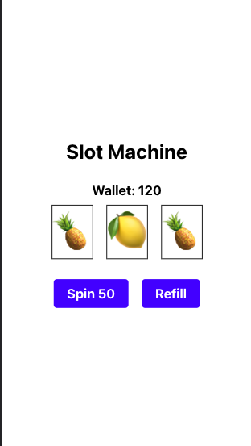

# Slot Machine Game

This is a simple slot machine game built using React Native. The game is based on the traditional slot machine, where a player spins the reels and hopes to get a winning combination.

## Rules:

- The game has three reels with various symbols on them.
- The player clicks the "spin" button to start the game.
- The reels spin and come to a stop, showing a random combination of symbols.
- If all three reels show the same symbol, the player wins the corresponding points for that symbol.
- The game has a limit of 5 spins, after which the player must refill the machine in order to continue playing.

### Technology Used:

- React Native: a JavaScript framework for building native mobile apps.
- Expo: a set of tools and services for building and deploying React Native apps.
npm: a package manager for Node.js packages.

## Features:

- The game uses a custom hook "useGame" to manage the game's state and logic.
- The game also uses a third-party library "react-native-slot-machine" to render the spinning reels animation.
- The game has a simple and intuitive UI design.
Installation and Usage:

- Clone the repository and install dependencies using "npm install".
- Run the app using "npm start" and follow the instructions in the Expo console to launch the app on an emulator or a physical device.

## Future Improvements:

- Add sound effects and animations to enhance the gameplay experience.
- Add a leaderboard to track high scores.
- Add the ability to customize the game with different themes and symbols.

## Contributing:

Contributions are welcome! Feel free to fork the repository and submit pull requests.